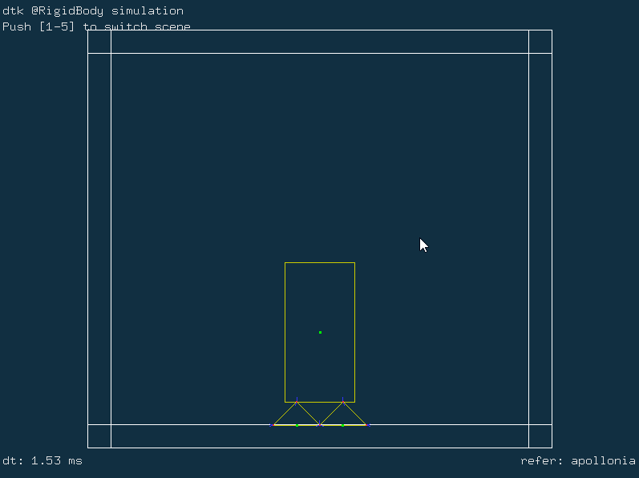
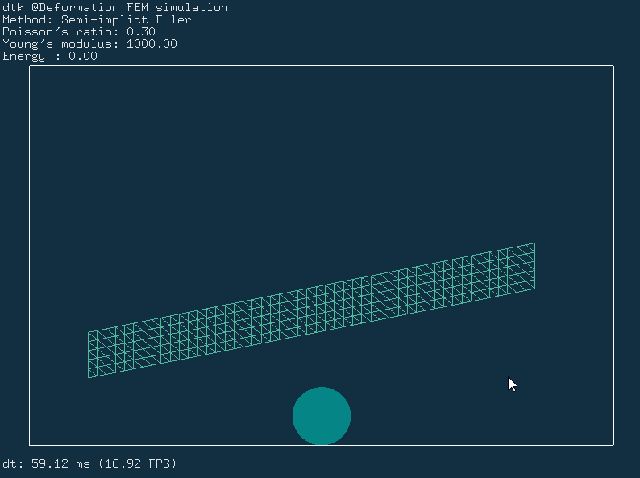

# dtk
A deformable toolkit used for deforamable physical simulation.

## Dependencies

### [Boost](https://github.com/boostorg/boost)

&emsp;&emsp;Boost is a mandatory dependency of CGAL. Binary versions of Boost are available on SourceForge. The Boost installers install both Boost headers and precompiled libraries. Please note that the CGAL project is not responsible for the files provided on this website. When CGAL 5.2.1 was released, the latest version of Boost was 1.71. A typical installation of Boost would consist of the following steps:

&emsp;&emsp;Download and run the file boost_1_71_0-msvc-XX.Y-64.exe (where XX.Y = 14.0 for VC 2015, XX.Y = 14.1 for 2017, XX.Y = 14.2 for VC 2019).
Extract the files to a new directory, e.g. c:\dev\libboost_1_71_0.
Set the following two environment variables to point respectively to the path of the libraries and the headers
```bash
  BOOST_LIBRARYDIR = C:\dev\libboost_1_71_0\lib64-msvc-XX.Y
  BOOST_INCLUDEDIR = C:\dev\libboost_1_71_0
```
as this will help cmake to find Boost.
Add the path to the Boost dlls (C:\dev\libboost_1_71_0\lib64-msvc-XX.Y) files to the PATH environment variable.


### [CGAL](https://github.com/CGAL/cgal)

&emsp;&emsp;CGAL offers data structures and algorithms like triangulations, Voronoi diagrams, Polygons, Cell Complexes and Polyhedra, arrangements of curves, mesh generation, geometry processing, convex hull algorithms, to name just a few.

&emsp;&emsp;All these data structures and algorithms operate on geometric objects like points and segments, and perform geometric tests on them. These objects and predicates are regrouped in CGAL Kernels.

&emsp;&emsp;Finally, the Support Library offers geometric object generators and spatial sorting functions, as well as a matrix search framework and a solver for linear and quadratic programs. It further offers interfaces to third party software such as the GUI libraries Qt, Geomview, and the Boost Graph Library.

&emsp;&emsp;[How to install CGAL](https://doc.cgal.org/latest/Manual/index.html)

### [Eigen](https://eigen.tuxfamily.org/index.php?title=Main_Page)

&emsp;Eigen is a C++ template library for linear algebra: matrices, vectors, numerical solvers, and related algorithms.

&emsp;&emsp;[How to build with Eigen](https://eigen.tuxfamily.org/dox/GettingStarted.html)

### [freeglut](http://freeglut.sourceforge.net)

&emsp;Freeglut, the Free OpenGL Utility Toolkit, is meant to be a free alternative to Mark Kilgard's GLUT library. 

&emsp;dtk Render by Opengl.

&emsp;&emsp;[How to build freeglut with CMAKE](https://doc.qt.io/qt-5/cmake-get-started.html#build-a-gui-executable)

## How to build

&emsp;&emsp;Dtk is build by CMake. so you can build easily.

### build with CMake GUI


### build with CLI

#### build static libary
&emsp;&emsp;First，configuarte with command:

```bash
$ cmake -S "DTK_DIR" -B "DESTINATION_STATIC_DIR" -D CMAKE_INSTALL_PREFIX="PATH TO INSTALL STATIC LIBS" -G "Generates"
```

&emsp;&emsp;second, install with:

```bash
$ cmake --build "DESTINATION_STATIC_DIR" --config Release --target install
```

#### build dynamic library

&emsp;&emsp;First，configuarte with command:

```bash
$ cmake -S "DTK_DIR" -B "DESTINATION_SHARED_DIR" -D BUILD_SHARED_LIBS=ON -D CMAKE_INSTALL_PREFIX="PATH TO INSTALL SHARED LIBS" -G "Generates"
```

&emsp;&emsp;second, install with:

```bash
$ cmake --build "DESTINATION_SHARED_DIR" --config Release --target install
```

## demo with dtk

### Rigid body Simulation demo

&emsp; A physical simulation demo for 2D rigid body in real time. It deals with the collision of the rigid body which has no deformation by SAT and AABB methods.

<div align="center">
  
</div>

### Finite element method simulation

&emsp;A finite element method physical simulation for 2D hyperelasticity deformation meterial body in real time.

<div align="center">
  
</div>

### SPH methods Simualtion

&emsp;A physical simulation demo for 2D fluid in real time. It deals with the fluid body by a series of SPH methods, which include WCSPH, PCISPH and DFSPH.

<div align = center>

</div>

&emsp;The SPH method is WCSPH, PCISPH and DFSPH from left to right.

### Guidewire Simulaiton

&emsp;A blood flow induced physical simulation of guidewire shape for virtual vascular intervention training system in real time. Virtual vascular intervention training system, which is a low cost, safe and effective solution, is able to provide an immersive virtual training environment for trainees.

<div align="center">
  
</div>

## Help Documentation

You can find help documentation [here](https://github.com/Deformable-Toolkit/dtk/blob/TOMbranch/doc/html/index.html).
