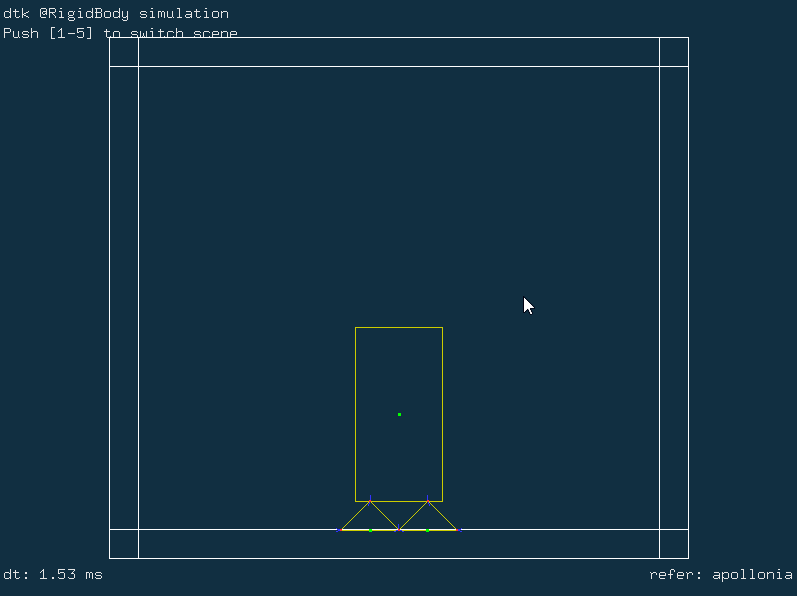

# RigidBodySimulation

A physical simulation demo for 2D rigid body in real time. It deals with the collision of the rigid body which has no deformation by SAT and AABB methods.

## Dependencies

### [Boost](https://github.com/boostorg/boost)

&emsp;&emsp;Boost is a mandatory dependency of CGAL. Binary versions of Boost are available on SourceForge. The Boost installers install both Boost headers and precompiled libraries. Please note that the CGAL project is not responsible for the files provided on this website. When CGAL 5.2.1 was released, the latest version of Boost was 1.71. A typical installation of Boost would consist of the following steps:

&emsp;&emsp;Download and run the file boost_1_71_0-msvc-XX.Y-64.exe (where XX.Y = 14.0 for VC 2015, XX.Y = 14.1 for 2017, XX.Y = 14.2 for VC 2019).
Extract the files to a new directory, e.g. c:\dev\libboost_1_71_0.
Set the following two environment variables to point respectively to the path of the libraries and the headers
```bash
  BOOST_LIBRARYDIR = C:\dev\libboost_1_71_0\lib64-msvc-XX.Y
  BOOST_INCLUDEDIR = C:\dev\libboost_1_71_0
```
as this will help cmake to find Boost.
Add the path to the Boost dlls (C:\dev\libboost_1_71_0\lib64-msvc-XX.Y) files to the PATH environment variable.


### [CGAL](https://github.com/CGAL/cgal)

&emsp;&emsp;CGAL offers data structures and algorithms like triangulations, Voronoi diagrams, Polygons, Cell Complexes and Polyhedra, arrangements of curves, mesh generation, geometry processing, convex hull algorithms, to name just a few.

&emsp;&emsp;All these data structures and algorithms operate on geometric objects like points and segments, and perform geometric tests on them. These objects and predicates are regrouped in CGAL Kernels.

&emsp;&emsp;Finally, the Support Library offers geometric object generators and spatial sorting functions, as well as a matrix search framework and a solver for linear and quadratic programs. It further offers interfaces to third party software such as the GUI libraries Qt, Geomview, and the Boost Graph Library.

&emsp;&emsp;[How to install CGAL](https://doc.cgal.org/latest/Manual/index.html)

### [freeglut](http://freeglut.sourceforge.net)

&emsp;Freeglut, the Free OpenGL Utility Toolkit, is meant to be a free alternative to Mark Kilgard's GLUT library. 

&emsp;RigidBody Render by Opengl and freeglut.

&emsp;&emsp;[How to build freeglut with CMAKE](https://doc.qt.io/qt-5/cmake-get-started.html#build-a-gui-executable)

### [dtk](https://github.com/Deformable-Toolkit/dtk)

&emsp;A deformable toolkit used for deforamable physical simulation

&emsp;&emsp;[How to build dtk with CMAKE](https://github.com/Deformable-Toolkit/dtk)

### [Eigen](https://eigen.tuxfamily.org/index.php?title=Main_Page)

&emsp;Eigen is a C++ template library for linear algebra: matrices, vectors, numerical solvers, and related algorithms.

&emsp;&emsp;[How to build with Eigen](https://eigen.tuxfamily.org/dox/GettingStarted.html)

## How to build

&emsp;&emsp;RigidBodySimuation is build by CMake. so you can build easily by CMAKE GUI or command line. 

### build with CLI

Before congiguration. Modify the CMakeLists.txt in current folder first.

#### build executable program

&emsp;&emsp;First，configuarte with command:

```bash
$ cmake -S "SRC_DIR" -B "DESTINATION_DIR" -G "Generator"
```

&emsp;&emsp;second, compile with:

```bash
$ cmake --build "DESTINATION_DIR" --config Release
```

### example

<div align="center">
  
</div>